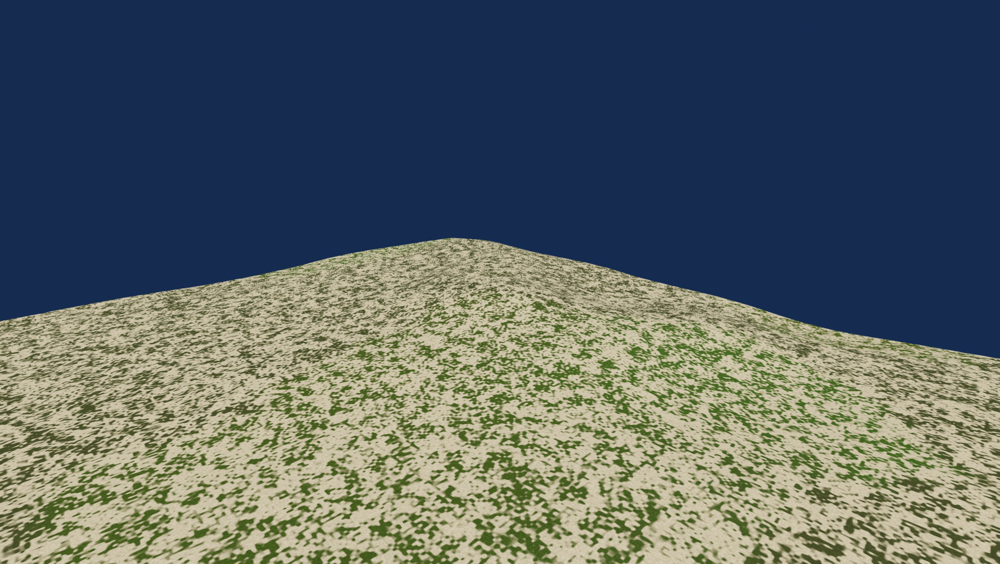
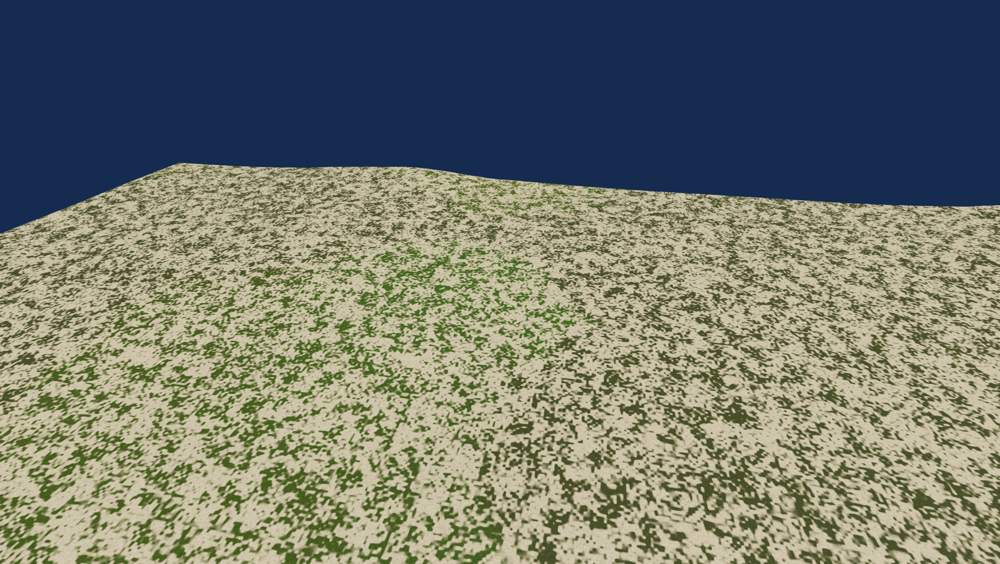
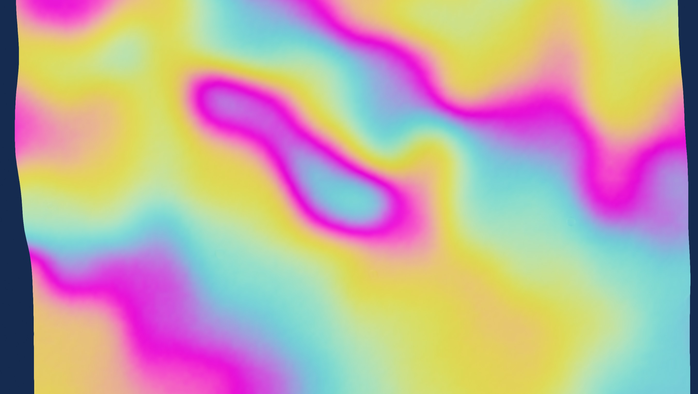
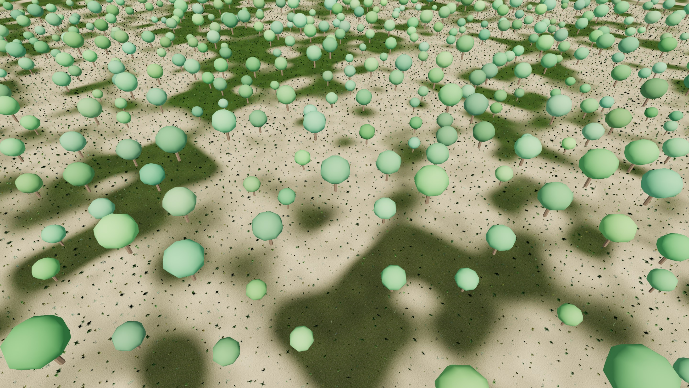
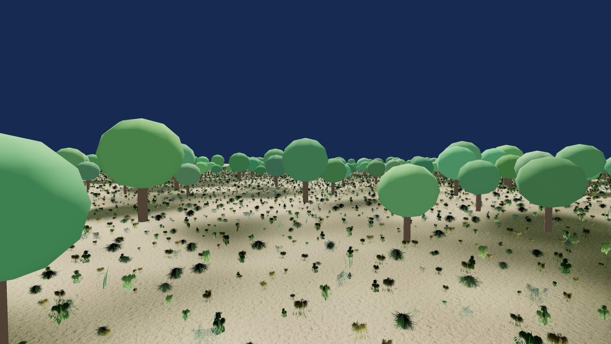
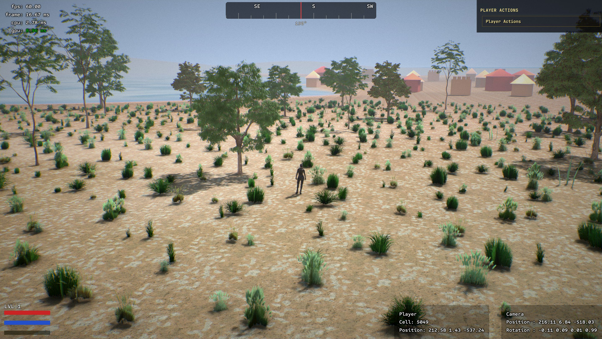

# Azgaar .map terrain — port plan

Replace the removed Blender-splat terrain with the old engine's (game-001-cpp)
Azgaar Fantasy Map Generator heightmap world: `.map`-driven biomes/props,
streaming runtime-generated heightmap tiles, CPU/physics/render surface parity.

Source of truth for all ports: `/home/enes/Projects/c/game-001-cpp`
(`c-engine/ecs/system/heightmap/`, `c-game/game/azgaar/`,
`c-game/game/loadingAzgaar/`, `c-engine/renderer/vulkan/pass/azgaar_*` +
`heightmap_terrain`).

## Architecture notes (carry over verbatim — these are hard-won invariants)

- **The surface is a pure function of (x, z).** `HeightmapSource::heightAt`
  must be deterministic for the process lifetime; evicted tiles regenerate
  bit-identical. CPU grid, physics grid and rendered lattice are all the same
  tensor-product bilinear surface.
- **Geometry detail band:** only fBm octaves with wavelength >= 64 m go into
  geometry (2 octaves: 128/64 m). Shorter wavelengths (32/16/8/4 m) are
  fragment-shader normal perturbation only — putting them in geometry aliases
  on the render lattice and grass/player float above the ground.
- **Settlement plateaus blend LAST** in heightAt, after the detail band, so
  ground under buildings is exactly flatY.
- **CPU precomputed lattice:** tile corners (world pos + border-aware stencil
  normal) are generated on the CPU at height-upload time; the vertex stage is
  a thin transform. This is what makes the pass portable to Filament (no VS
  texture fetches, `vertex()` stays empty) — do not reintroduce implicit
  lattice enumeration in the VS.
- Tile grid: 2048 m edge, 512² heights (4 m texels, endpoints shared for
  watertight borders), 256² physics (~8 m). 5×5 window, LRU eviction,
  background builder thread, `readyStamp` as GPU re-upload cache key.

## Phases

### 1. Remove legacy splat terrain ✅ (done)

Removed: `c-engine/terrain/`, `scripts/build-terrain.py` + `ktx2bc7.c`,
`tools/terrain-chunker/`, pak_1 terrain data, CMake matc target,
`gltfEntitiesNamed` + `NameComponentManager` plumbing, Game.cpp wiring.

### 2. Azgaar world model (.map parse)

Port `AzgaarWorld` + `LoadingAzgaar` into `c-game/game/azgaar/` /
`c-game/game/loadingAzgaar/`. The new engine's `ecs/System` base matches the
old one, so this is near-verbatim:

- `.map` JSON parse: cells (section 1), biomes with colors + habitability +
  icon lists/density (section 3), climate temp/precip/coast/feature
  (sections 8–11), rivers (section 32 + section 5 SVG centerlines),
  settlements (section 15), states/provinces (section 14), landmarks,
  roads (corridors + decals).
- Ship a test map: `c-game/data/pak_1/azgaar/*.map` (old engine ships
  `Chilerel 2026-08-11-15-35.map` — reuse).
- Height helpers: `azgaarWorldSampleHeightSmooth`, `azgaarHeightToMeters`,
  `metersPerPixel`.
- **Acceptance:** log parsed world stats (cells, biomes, river count,
  settlement count, size in metres) after load.

### 3. HeightmapTerrain streaming core

Port `c-engine/ecs/system/heightmap/` (HeightmapSource vtable, HeightmapTile,
window/LRU/eviction, background builder thread, snapshot/copy APIs,
`heightmapTerrainSample`) into the new engine's `c-engine/ecs/`.
Phase-1 scope: CPU grids only; `gpuData`/`physicsData` pointers stay
reserved and unused until phases 5/9.

### 4. AzgaarHeightmapSource

Port the adapter: FMG macro height + seeded (FNV-1a of map name) 2-octave
value-noise detail band + settlement plateau blend. Keep the seabed detail
fade (-10 m → 0).

### 5. Filament terrain render pass ✅ (done)

- Per READY tile: generate 256² lattice corners (world pos + border-aware
  normal) on the CPU, upload VBO + shared 255-segment IBO.
- Shader10 material (`terrain.mat`): all look work in `surface()`:
  ground texture blend, micro-band normal perturbation (32/16/8/4 m),
  per-world biome color / climate blend textures (registered at world load),
  waterline. `vertex()` empty.
- Register climate/biome textures from the Azgaar world at load.
- **Acceptance:** `ENGINE_SCREENSHOT` shows streaming terrain following the
  camera; borders watertight (no seams); height ramp debug view matches CPU
  grid.

**Acceptance report (2026-09-03, Chilerel 80×80 km, RX 7900 XTX / radv):**

- Look: faithful port of the old engine's `heightmap_terrain.frag` (same
  grass tiling, biome tint, dry-turf noise, beach/wet-sand band, slope+
  altitude cliff triplanar, climate snow line, micro-band normal pass).
  Same KTX2 assets on both engines.
   — highest land
  point (grass/dry-turf at 583 m); default camera:
  
- Follow/evict: 400 m/s dolly over 33 s — window slid 6 tiles (12 km),
  45 re-uploads, builder stayed ahead (steady `ready=20 queued=5`), surface
  continuous the whole run (`ENGINE_CAMERA_DOLLY` +
  `ENGINE_SCREENSHOT_FRAME`).
- Seams: top-down height-ramp shot over the peak — no straight-line
  discontinuities at tile borders:
  
- CPU cost (one-shot log, avg of 1000 frames after 120-frame warmup,
  5×5 window): static 0.000 ms (system) + 0.005 ms (render pass);
  continuous 400 m/s travel 0.000 + 0.450 ms — under the 1.5 ms budget in
  both cases.
- Memory, steady state: CPU 31.2 MB (25 resident grids) + GPU 45.2 MB
  (25 VBOs + shared IBO) = 76.5 MB for the resident window — under the
  150 MB budget; flat while evicting/re-uploading (no leak).
- Hard-won pitfalls recorded in `docs/lessons.md` (setBufferAt no-copy,
  tiling-texture sampling, photometric emissive).

### 6. Diligent terrain render pass ⏸ (deferred — Diligent backend ignored for now)

HLSL mirror of phase 5 (pre-compiled at build time per
`plans/diligent-migration.md`). Same CPU lattice, same surface invariant.
Revisit only if we return to the Diligent backend.

### 7. Props / vegetation ✅ (done)

Port `AzgaarProps` scatter (biome `icons` × repetition weight × `iconsDensity`,
Delaunay jitter, samples the _physics_ grid for ground height — never the
finer CPU grid) + billboard render pass (Filament path only; Diligent
deferred with phase 6).

What shipped (Filament path only, per the architecture decision):

- `c-game/game/azgaar/AzgaarProps.{h,cpp}` — deterministic per-tile CPU
  scatter on a background worker (one worker, ~128 ms/tile); instance Y
  comes ONLY from the 256² physics grid (`heightmapGridBilinear` over the
  physics-tile copy); scatter-time XZ ground-plane cull caps per species
  (grass 440 m, trees 840 m — deliberately ground-plane, not 3D, so aerial
  validation cameras still see props).
- `c-game/game/azgaar/AzgaarPropMesh.{h,cpp}` — 12 procedural species + 7
  grass-card variants merged into one VBO/IBO with per-(species,variant)
  index ranges (729 verts / 1638 idx / 19 ranges; 52 B Filament-native
  vertex with TBN-quaternion repack).
- `c-engine/renderer/PropsRender.{h,cpp}` + `filament/PropsRenderFilament.cpp`
  + `props.mat` (matrix-packed `instanceTransform`-style data via a
  per-tile RGBA32F instance texture, `instanced:true` + chunked
  InstancedDraw ≤ 32767, per-(tile,range,chunk) MaterialInstance with the
  range's world AABB, wind phase uniform).
- `Game.cpp` wiring: init/update/destroy bridge, `ENGINE_CAMERA=props`
  (densest tree-density tile framing) and `ENGINE_CAMERA=propsground`
  (7 m eye height over the same point); `ENGINE_NO_PROPS=1` control.
- Instrumentation (kept): `PropsRenderStats`/`AzgaarPropsStats` + the
  `ENGINE_PROPS_PERF=1` periodic log + one-shot budget acceptance line.

**Acceptance report (2026-09-04, Chilerel 80×80 km, RX 7900 XTX / radv):**

Verification command (exit 0, clean teardown, no Filament panics):
`ENGINE_AUTOTEST=enter ENGINE_CAMERA=props ENGINE_SCREENSHOT_FRAME=600
ENGINE_SCREENSHOT=... ./build/c-game/c-game` after `./scripts/build.sh`.

- CPU scatter gates (logged every run): re-scatter bit-identical per
  (mapSeed, tile), Y-on-surface maxErr 0.000000 m PASS, 25 resident tiles
  built in 3.2 s; 2 tiles keep instances (72016 total: tile(13,-6) 71978 →
  9 draws + border tile 38) — the other 23 keep 0 by design (fully beyond
  the XZ cull caps), matching the old engine's player-local scatter.
- Visual: dense broadleaf woodland over grass, individually readable trees
  (trunk + faceted canopy + per-instance scale/hue variation), correctly
  grounded (no floating/sinking), contact shadows:
   —
  `ENGINE_CAMERA=props` oblique; matched to the old-engine reference
  vantage at 7 m eye height (`ENGINE_CAMERA=propsground`):
   — visible
  trunks, clumped distribution with bare holes, grass undergrowth, mid-field
  tree bands + far tree line. Within-biome structure (clumped trees +
  grass + bare patches) matches the old-engine reference; absolute density
  is not comparable 1:1 (our framing is the densest tree tile on the map,
  the reference is a dry-turf biome).
- Per-frame cost vs the ≤ 1.5 ms budget (120-frame rolling avg, 1000-frame
  measurement after warmup): static 0.004 ms (game bridge) + 0.001 ms
  (render pass) = 0.005 ms/frame; 100 m/s dolly 0.014 ms; 400 m/s dolly
  0.005 ms; initial world-load fill bursts to 1.33 ms avg over the first
  120 frames (still under budget).
- Streaming follow/evict (dolly runs): 100 m/s backward 30 s — 35 claims,
  37 re-scatters, 10 evictions, queue ≤ 3 transient, worker never
  saturated; 400 m/s stress 20 s — 41 claims, 80 re-scatters, 16 evictions
  (incl. one 31781-instance tile), queue drains, no stall; forward 100 m/s
  — 12 re-scatters ahead of the camera, 0 window evictions (in-tile follow).
- Memory vs the ≤ 150 MB terrain+props shared budget: peak 57.8 MB
  (props alone ≤ 12.6 MB GPU + 4.2 MB staging + 3.9 MB CPU at the 4-tile
  level-camera peak; declines while evicting — no leak).
- Instances vs the old engine's 5 M grass cap: peak 141 k = 2.8%.
- Debuggability: all D1–D47 GPU probe scaffolding and the 7 probe
  materials were removed at sign-off (PropsRenderFilament.cpp 2360 → 822
  lines); the shot is byte-identical before/after the strip (wind-phase
  real-dt jitter makes 600-frame shots vary ~1–3% run-to-run regardless).

Accepted gaps (not props bugs; deferred art/atmosphere): flat navy sky +
hard fog-less horizon (weather/atmosphere = phase 8), procedural
flat-shaded tree art vs the old textured alpha-cut canopies, no
bushes/yucca species in frame (biome mix), grass-card alpha reads washed
out in a few tufts. Hard-won pitfalls recorded in `docs/lessons.md`
(camera-relative `material.worldPosition` + `getCustom0()`, transform-
after-build compat quirk, no-copy buffer lifetimes).

### 8. Water, rivers, roads, settlements

`AzgaarWater` (global water plane + shoreline), `AzgaarRivers` (centerline
ribbons), `AzgaarRoadCorridor` + `AzgaarRoadDecals`, `AzgaarSettlements`
(flatY plateaus already in heightAt; buildings/props). Weather is deferred —
not needed for the terrain cut.

### 9. Gameplay hooks + physics

- Camera framing from world bounds (replace the TODO in `Game::loadWorld`).
- Ground height query for the future player (`heightmapTerrainSample` /
  physics-tile copy).
- Collision: Jolt heightfields per tile (old engine phase 3) or a custom
  bilinear-grid raycast — decide when the player lands; the grids are ready
  either way.

## Reference — old engine target (compare final results against this)

Old-engine (game-001-cpp) screenshot, Chilerel map, same Azgaar terrain
stack — the visual target for the completed port. Captured 2026-09-03, saved
from `/var/home/enes/Screenshots/Screenshot_20260903_052713.jpeg`.

In frame: dry-turf biome ground with micro-banding, dense biome props
(grass tufts + acacia-style trees, phase 7), settlement with building
clusters on a plateau at the coast (phase 8), shoreline + global water
plane (phase 8), and the player standing on the surface (phase 9 ground
query). After phases 7–9 land, re-capture an equivalent frame
(`ENGINE_SCREENSHOT`) from the new engine at a matching world position and
diff side-by-side: ground look, prop density/distribution, settlement
placement, waterline.

## Out of scope (for now)

Diligent backend for all azgaar terrain work (decision: Diligent is ignored
for the time being; Filament path only),
Per-ring LOD ladder (needs per-ring CPU corner sets, not VS math),
TAA/HiZ/motion-vector pipeline on the Filament path (scene-wide, separate
workstream), `AzgaarWeather`.
